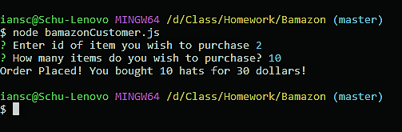
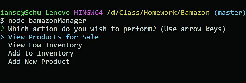
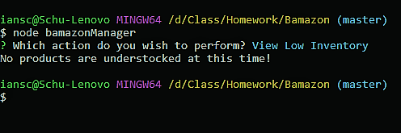
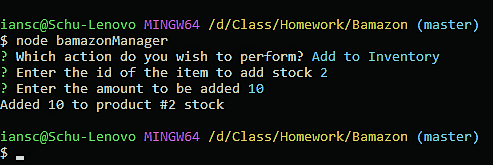
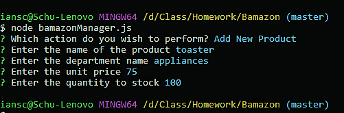

# Bamazon

CLI storefront with mySQL database.

##Overview

Bamazon simulates an online sotrefront experience via the command line. 
It contains three node apps: 
    *bamazonCustomer
    *bamazonManager
    *bamazonSupervisor

##bamazonCustomer.js

Simulates a simple store interface with the user playing the part of customer. 
The customer is given two prompts, which allow them to select the product and quantity they wish to purchase.

The app adjusts the inventory in the linked mysql table, and displays the purchase price for the customer.

##bamazonManager.js

Simulates a manager login for an online store. 
The manager if offered a menu of four possible commands:

1. Show All Products
lists info for all products in store

2. Show Low Inventory
lists info for all products with inventory under 5

    *If all inventory is above 5, display message

3. Add Inventory
Allows manager to chose item to add stock too, and to chose amount of stock to add

4. Add New Product
Allows manager to add new product to the store by answering a series of prompts

##bamazonSupervisor.js

Simulates a supervisor view of bamazon corp, allowing an overview of different departments and total profits

NOT YET IMPLEMENTED

